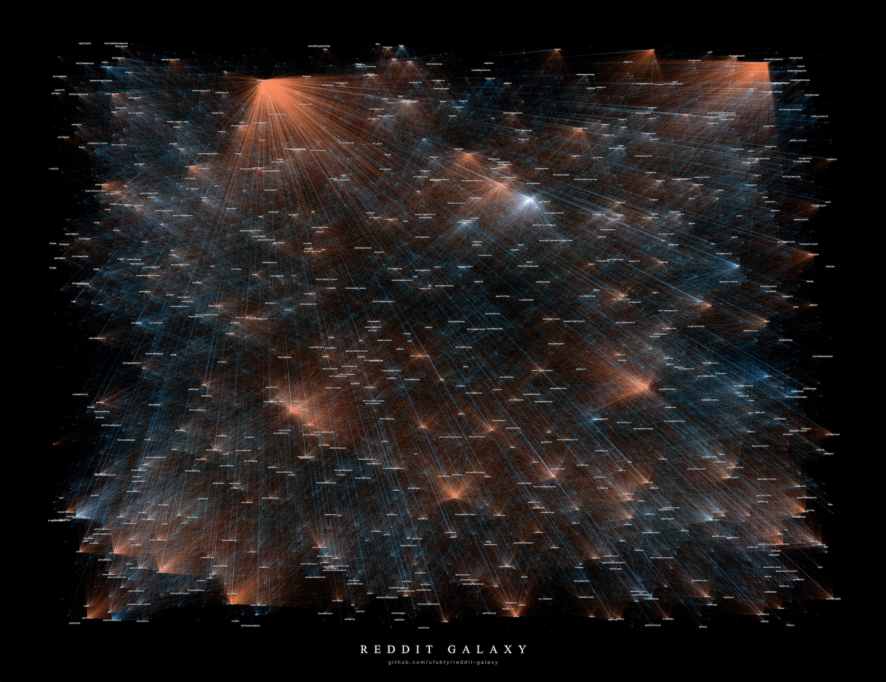

# reddit-galaxy



[Full resolution 7920x6100px](images/post-processed-1x-cg.jpg)

-   Edges (links of the network) are representing all of the hyperlinks which posted in a subreddit and points to another subreddit.

-   Orange end of each link represents the source subreddit, and blue end represents the target.

-   Orangish subreddits have lots of outgoing hyperlinks. Blueish subreddits have lots of incoming hyperlinks. Albescent subs has both incoming and outgoing hyperlinks in large amount.

-   Links are weighted and weights are the number of total post between two subs. Weights are represented by opacity in the image. Minimum opacity is 0.02

-   There are 54.075 subreddits and 571.927 posts/hyperlinks in dataset and 234.792 weighted links were drawn.

-   Locations are randomly assigned and only the top 600 most-linked and top 400 most-linker subs are labeled.

-   I needed to increase the visibility of blue edges because they are more distributed than orange ends and was suppressed by orange areas.

# Step-by-step guide

## Requirements

-   `Apache Spark 3.0.1`
-   `Hadoop 2.7.7`
-   `matplotlib`
-   `networkx`

## Download

**Code**

Download the code from [Code ↓](https://github.com/ufukty/reddit-galaxy/archive/main.zip) button above or run this command:

```sh
git clone https://github.com/ufukty/reddit-galaxy.git
```

**Dataset**

Download `soc-redditHyperlinks-title.tsv` file and place it in the root of this project

[https://snap.stanford.edu/data/soc-RedditHyperlinks.html](https://snap.stanford.edu/data/soc-RedditHyperlinks.html)

## Run

Open Terminal and run those commands:

**Load data into Hadoop**

```sh
hadoop fs -mkdir hadoop_dataset
hadoop fs -put *.tsv hadoop_dataset
```

**Open spark-shell**

```sh
spark-shell
scala> :load 1.scala
```

**Run the python code**

```sh
python 2.py
```

`output` folder should be created.

# License

GNU General Public License v3.0  
Read the LICENSE file for details